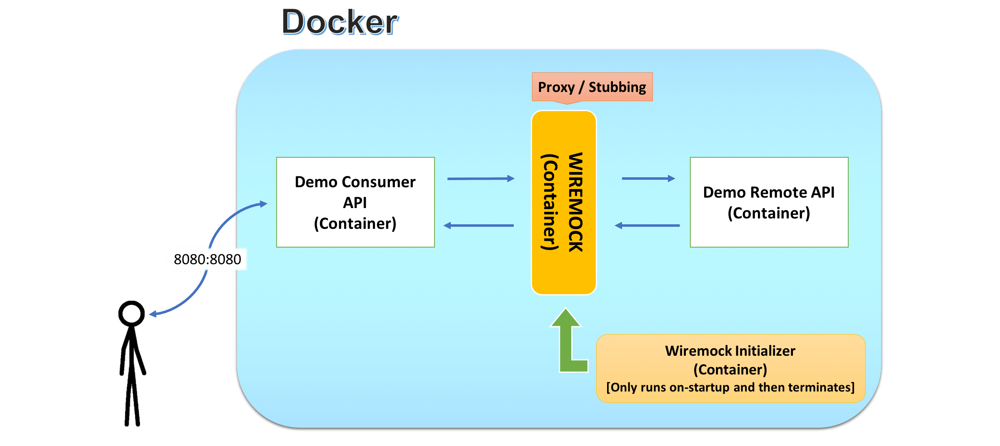

# A Case Study With Wiremock

## 1. Installation

### 1.1. Building Sources

ℹ️  Make sure your system have `java 8` installed on it, and please verify that `maven` will run with `java 1.8` (`java 1.9` breaks latest stable version of spring-boot, and doesn't compile). If default `java` version is different than required version, you can set java home by `export JAVA_HOME=<path-to-jdk>` [note: jdk path should be parent directory, not `bin`]

```bash
➜  ./mvnw -version

Apache Maven 3.5.2 (138edd61fd100ec658bfa2d307c43b76940a5d7d; 2017-10-18T10:58:13+03:00)
Maven home: /Users/<user>/.m2/wrapper/dists/apache-maven-3.5.2-bin/28qa8v9e2mq69covern8vmdkj0/apache-maven-3.5.2
Java version: 1.8.0_152, vendor: Oracle Corporation
Java home: /Library/Java/JavaVirtualMachines/jdk1.8.0_152.jdk/Contents/Home/jre
Default locale: en_TR, platform encoding: UTF-8
OS name: "mac os x", version: "10.13.3", arch: "x86_64", family: "mac"
```

ℹ️  Make sure docker and docker-compose are installed on the system, and docker daemon is running:

```bash
➜  docker -v      
Docker version 17.09.0-ce, build afdb6d4
➜  docker-compose -v
docker-compose version 1.16.1, build 6d1ac21
```

To build applications & docker images:

```bash
➜  ./mvnw clean verify
```

### 1.2. Starting Applications

```bash
➜  docker-compose -p wiremock-demo -f dc-wiremock-demo.yml up -d 
```

## 2. Demo Application Architecture

<br/>



<br/>

## 2.1. Demo Consumer API
### 2.1.1. Greetings Service

**Request Method Signature**

```bash
GET http://localhost:8080/hi/{name}
```

**Response**

```bash
Hi {name}!
```

|Pameter|Meaning|
|---|---|
|name|Name of a person to greet|

### 2.1.2. Wiremock Mappings

Wiremock contains a few different mappings.

#### 2.1.2.1. Request stubbing for `test` with response templating

This mapping produces a custom response for `test`

```bash
{
  "request": {
    "urlPattern": "/hi/[tT][eE][sS][tT]",
    "method": "GET"
  },
  "response": {
    "status": 200,
    "body": "Welcome {{request.path.[1]}}!",
    "headers": {
      "Content-Type": "text/plain;charset=UTF-8"
    },
    "transformers": [
      "response-template"
    ]
  }
}
```

#### 2.1.2.2. Proxy all other traffic

Wiremock checks this mapping after all other mappings because of lowest priority at the definition [at this example: `"priority": 10`]. Default priority is `5`. High number means lower priority.

```bash
{
  "priority": 10,
  "request": {
    "headers": {
      "Host": {
        "equalTo": "demo-remote-api:8080"
      }
    }
  },
  "response": {
    "proxyBaseUrl": "http://demo-remote-api:8080"
  }
}
```

[**Please check Wiremock Documentation for other features and further information**](https://wiremock.org/docs/)

---

by [@veysiertekin](https://github.com/veysiertekin)
